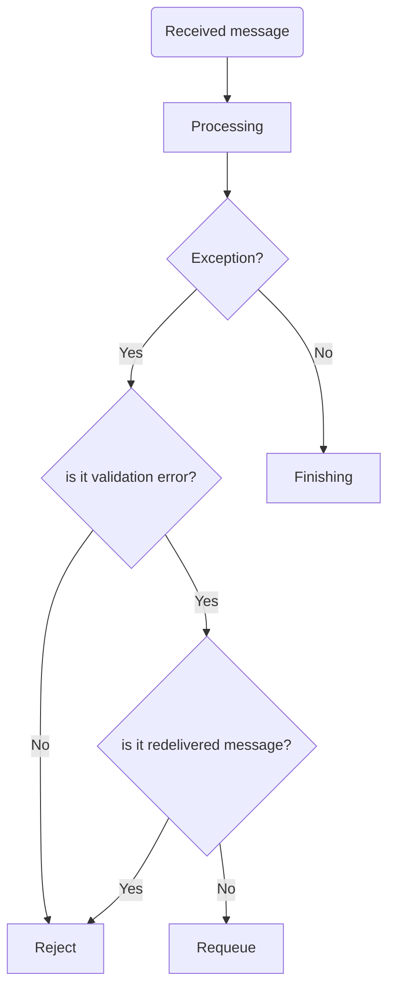

## RMQ consumer's flow

```mermaid
graph TD
    A(Received message) -->B[Processing]
    B --> C{Exception?}
    C -->|Yes| D{is it validation error?}
    C -->|No| Finishing
    D -->|Yes| F{is it redelivered message?}
    D -->|No| Reject
    F -->|Yes| Reject
    F -->|No| Requeue
```

Changelog
=========

1.0.0 (02 Feb 2020)
-------------
- Added version field to the message body